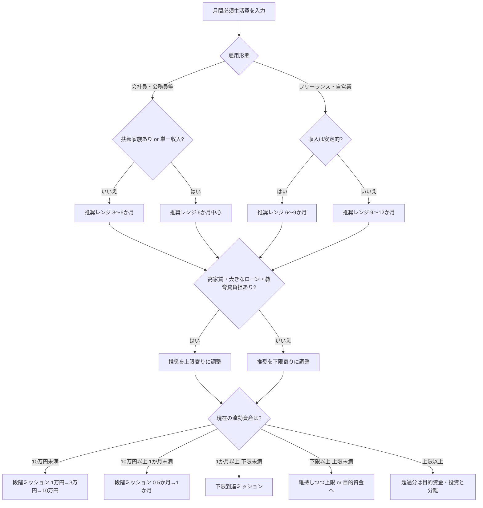

# 日本在住者向けの生活防衛資金と貯金目安と固定費改善の一般基準

## Executive summary

日本の公的機関の発信は、**生活防衛資金の月数を一律に断定する**というより、まず**家計管理とライフプランを整える**という姿勢が強いです。金融庁は家計管理の基本を「収入と支出の把握」「収支の黒字化」「黒字分の貯蓄」と整理し、J-FLEC教材も「全生徒に共通の『正解』はない」と明記しています。一方で、銀行・証券・FP団体・主要メディアは、実務上の目安として、**会社員はおおむね生活費の3〜6か月分、フリーランスは6〜12か月分**を提示する傾向があり、子どもがいる世帯、単一収入世帯、教育費が重い時期は**上限寄り**に見る考え方が目立ちます。 citeturn14view0turn14view1turn29search1turn35view2turn35view4turn35view5turn35view7turn37search0

総務省統計局の最新公表では、2025年の月平均消費支出は**単身世帯17万3,042円、二人以上世帯31万4,001円**です。さらに全国家計構造調査では、**30代夫婦のみ世帯30万1,952円、夫婦と子ども2人で長子未就学児27万9,645円、長子が小・中学生30万9,485円、長子が大学生等46万5,347円、夫婦と未婚の子どもがいる勤労者世帯30万9,800円**と、子どもの成長段階で必要額がかなり変わることが確認できます。したがって、診断サイトでは**全国平均を“正解”にせず、ユーザー自身の必須生活費を主軸**にし、統計値は入力不十分時の補助値として使うのが安全です。 citeturn22view0turn24view0turn22view1turn23view1turn40view0

貯金ゼロ〜少額の人に対しては、いきなり「6か月分」を迫るより、**1万円 → 3万円 → 10万円 → 半月分 → 1か月分 → 推奨レンジ下限**という段階設計のほうが、行動に移しやすく、離脱しにくいです。これは公的な統一基準ではありませんが、J-FLECが示す**平均値と中央値の乖離**、全国銀行協会やりそな銀行が勧める**先取り貯蓄**、りそな銀行の記事が示す**無理なく続けられる小さな目標**という発想と整合的です。 citeturn38view3turn39view0turn34view2turn35view8turn31search6

固定費の見直しは、**家賃・住宅ローン、保険、通信、サブスク、光熱費、ローン依存の是正**が中核です。日本FP協会、全国銀行協会、みずほ銀行はいずれも、**変動費より固定費から着手するほうが継続効果が大きい**という点で一致しています。特に住居費は金額インパクトが大きく、保険は過大保障・不要特約の削減余地が出やすく、通信やサブスクは取り掛かりやすい“即効性のある改善項目”です。 citeturn34view0turn34view1turn34view2turn34view3turn34view4turn34view5

ジユウノコンパスの診断ロジックは、**単一の正解金額を言い切る型**ではなく、**推奨レンジと、なぜそのレンジになるのかを説明する型**が最も根拠に合っています。表示としては、`下限目標` と `安心寄り目標` の二段階を出し、ユーザーには「不足」ではなく「いまは○段階目」という進捗表現で見せるのが、根拠面でもUX面でも相性がよいです。 citeturn14view0turn14view1turn29search1turn35view4turn35view7

## 調査の土台となる共通理解

金融庁のNISA特設サイトは、資産形成の前提として、**お金が必要なタイミングも金額も人それぞれ**であることを示し、家計管理の基本を「収入と支出をきちんと把握・管理すること」「収支を黒字にすること」「黒字分を貯蓄すること」と整理しています。J-FLECの教材も、資産形成を生活設計・家計管理の一環と位置づけたうえで、**「全生徒に共通の『正解』はない」**としており、サイト診断もこの前提を引き継ぐのが自然です。 citeturn14view0turn14view1

この前提から逆算すると、生活防衛資金は「平均的にいくらあるべきか」より、**収入が止まったときに、何をどこまで維持したいか**で決めるものです。つまり、診断ロジックの主語は「世間の平均」ではなく、**その人の必須生活費、働き方、扶養の有無、社会保障へのアクセス**であるべきです。銀行・FP団体・メディアが月数を示していても、それは**実務上のレンジ**であって、公的な一律基準ではありません。 citeturn14view0turn14view1turn29search1turn35view2turn35view4turn35view7

そのうえで、生活防衛資金は**流動性の高い現預金で持つ**という考え方が、日本の実態とも整合的です。日銀の資金循環統計では、2025年12月末時点で家計の金融資産は2,351兆円、そのうち**現金・預金が1,140兆円で48.5%**を占めています。加えて、三菱UFJ銀行も、生活資金や万一への備えは**普通預金や定期預金など流動性の高い商品**に置く考え方を示しています。 citeturn33view1turn35view10

### 出典比較表

| 出典名 | 推奨月数・金額 | 対象 | 根拠の置き方 | 発行年 |
|---|---|---|---|---|
| 金融庁 NISA特設サイト「資産形成の基本」 citeturn14view0 | 月数は明示せず | 全成人 | 家計管理とライフプランが先。お金の必要額・時期は人それぞれ | ページ上に記載なし |
| J-FLEC教材「これであなたもひとり立ち」 citeturn14view1 | 月数は明示せず | 全成人向けの金融教育原則 | 資産形成は生活設計・家計管理の一環で、共通の正解はない | 2024 |
| 日本FP協会 FP Journal Online citeturn29search1 | 3〜6か月分 | 一般家計 | 病気・失業・災害など不測の事態への備え | 2025 |
| 三菱UFJ銀行コラム citeturn35view2 | 3〜6か月分 | 一般家計 | 家族構成やライフプランによるが、急な出費に耐える手持ち資金の目安 | ページ上に記載なし |
| りそな銀行コラム citeturn35view8 | 生活費6か月分程度 | 一般家計 | ライフイベントや突発支出への備えを具体目標化 | ページ上に記載なし |
| 三井住友銀行 Money VIVA citeturn37search0 | 半年〜1年分 | 一般家計 | 「使う袋」「ためる袋」を分け、生活防衛資金を別管理 | ページ上に記載なし |
| 東海東京証券メディア citeturn35view4 | 会社員3〜6か月、フリーランス6〜12か月 | 単身〜世帯 | 会社員は傷病手当・失業手当等の社会保障あり、フリーランスは保障が手薄 | 2024 |
| MONEY PLUS citeturn35view5turn10search9 | 一般家計は最低3か月・余裕があれば6か月、フリーランス6〜12か月 | 一般家計・フリーランス | 傷病手当や収入停止リスクから逆算 | 2023 / 2024 |
| 日経 STYLE citeturn35view7 | 最低6か月、状況に応じ1〜2年、自営業は最低1年 | 教育費を抱える家計を含む一般家計 | コロナ後は半年で足りないケースがあり、自営業は厚めの備えを推奨 | 2020 |
| 総務省統計局「家計調査」 citeturn22view0 | 単身17.3万円、二人以上31.4万円 | 全国平均の支出参考値 | 2025年平均の月間消費支出 | 2026公表・対象2025年 |
| 総務省統計局「全国家計構造調査」 citeturn24view0turn40view0 | 30代夫婦30.2万円、子あり世帯27.9万〜46.5万円など | 世帯類型別の参考値 | 子どもの年齢段階や世帯形態で支出構造が変わる | 2025公表 |

公的機関は**考え方の土台**を示し、銀行・証券・FP団体・メディアは**行動しやすい月数レンジ**を示す、という役割分担がかなりはっきりしています。ジユウノコンパスでは、この違いをそのまま活かし、**公的根拠で“なぜ人によって違うのか”を説明し、実務レンジは金融機関・FP団体の相場観から提示する**実装がもっとも整合的です。 citeturn14view0turn14view1turn29search1turn35view2turn35view4turn35view7

## 生活防衛資金の一般基準

日本語ソースを横断すると、最頻値に近い一般基準は、**会社員は3〜6か月、フリーランスは6〜12か月**です。日本FP協会、三菱UFJ銀行、東海東京証券、MONEY PLUSはこのレンジで概ね一致しており、日経STYLEやSMBC系記事は、コロナ禍以降の不確実性を踏まえて**6か月を下限に、1年程度まで見てもよい**という上振れの考え方を示しています。 citeturn29search1turn35view2turn35view4turn35view5turn35view7turn37search0

この差が生まれる理由は、月数の「好み」ではなく、**収入停止時に使えるセーフティネットの厚さ**です。会社員は、一般離職者であれば雇用保険の基本手当の所定給付日数が**90〜150日**が中心で、健康保険の傷病手当金も**支給開始日から通算1年6か月**、支給額は**1日あたり標準報酬日額相当の約3分の2**が基本です。対して、日本年金機構・厚労省の任意加入リーフレットは、**国民年金・国民健康保険よりも厚生年金・健康保険のほうが、病気・けが・出産で休んだ場合の所得保障が厚い**ことを図示しており、東海東京証券やMONEY PLUSがフリーランス側を厚めに見る理由と一致します。 citeturn36search0turn36search2turn12search4turn27view0turn35view4turn35view5

したがって、診断サイトの設計では、**月数の単独表示よりも「下限レンジ／安心寄りレンジ」の二段表示**が向いています。たとえば会社員なら「3〜6か月」、フリーランスなら「6〜12か月」を出し、子どもあり・単一収入・家賃負担が重い場合は**上限寄りを推奨する理由**を併記するほうが、根拠とUXの両面で自然です。 citeturn29search1turn35view2turn35view4turn35view7

## 世帯別・雇用形態別の目安

生活防衛資金は、本来は**月間必須生活費 × 推奨月数**で決めるのが最も正確です。ここでいう月間必須生活費は、少なくとも**住居費、光熱費、通信費、保険料、最低限の食費、通勤交通費、教育・保育の固定部分、医療の定常負担、最低返済額**を含めて把握するのが実務的です。金融庁と全国銀行協会が共通して、まず家計を見える化し、固定費から見直すことを勧めているのは、この「必須コスト把握」が先だからです。 citeturn14view0turn34view2turn34view3

下の表は、**ユーザー入力がない場合の仮置き参考値**として使いやすい整理です。金額は総務省統計局の支出データからの概算であり、実診断では必ずユーザー自身の家計入力で上書きする前提が望ましいです。 citeturn22view0turn24view0turn40view0

| 世帯・雇用 | 月間支出の参考値 | 推奨レンジ | 金額の目安 | 上限寄りに寄せる理由 |
|---|---:|---:|---:|---|
| 独身・会社員 | 約17.3万円（単身平均） citeturn22view0 | 3〜6か月 citeturn29search1turn35view2 | 約52万〜104万円 | 失業・傷病手当はあるが、家族の支援が薄い場合は6か月寄り |
| 夫婦・会社員 | 約30.2万円（30代夫婦）〜31.4万円（二人以上平均） citeturn24view0turn22view0 | 3〜6か月 citeturn29search1turn35view2 | 約91万〜188万円 | 片働き、ボーナス依存、高家賃なら6か月寄り |
| 子持ち・会社員 | 約28.0万〜31.0万円、大学生期は約46.5万円 citeturn24view0turn40view0 | 6〜12か月が無難 citeturn35view4turn35view7 | 約168万〜372万円、大学生期は約279万〜558万円 | 教育費・被服費・食費が増え、成長段階による振れ幅が大きい |
| 独身・フリーランス | 約17.3万円（単身平均） citeturn22view0 | 6〜12か月 citeturn35view4turn35view5 | 約104万〜208万円 | 傷病手当・失業給付の薄さ、案件変動 |
| 夫婦・フリーランス | 約30.2万〜31.4万円 citeturn24view0turn22view0 | 6〜12か月 citeturn35view4turn35view5 | 約181万〜377万円 | 夫婦双方が不安定収入なら上限寄り |
| 子持ち・フリーランス | 約28.0万〜31.0万円、大学生期は約46.5万円 citeturn24view0turn40view0 | 6〜12か月、状況次第で12か月寄り citeturn35view4turn35view7 | 約168万〜372万円、大学生期は約279万〜558万円 | 教育費と収入変動の二重リスク |

世帯別に見ると、**独身は総額は小さくても、支え手が自分だけ**という弱さがあります。夫婦世帯は共働きならリスク分散が効きやすい一方、総務省の全国家計構造調査では、30代夫婦のみ世帯は**住居費の比率が19.0%と高い**ため、家賃・住宅ローン負担が重い場合は下限に寄せすぎないほうが安全です。 citeturn38view1

子持ち世帯はさらに差が大きく、子どもが小さい時期は被服費や住居・保育関連、学校期は食費、大学生期は**教育費比率が28.1%**まで跳ね上がります。加えて、総務省の別図表では、夫婦と未婚の子どもがいる勤労者世帯の消費支出は**30万9,800円**で、母子世帯より大きく、教育や住居の支出割合も高いことが示されています。つまり、**「子持ち」は一括りではなく、子どもの年齢段階で必要額がかなり変わる**という作りにしたほうが、診断精度は上がります。 citeturn24view0turn40view0

## 貯金ゼロからの段階プラン

ここは、**公的統一基準の紹介**ではなく、**ジユウノコンパス向けの実務設計案**です。金融庁とJ-FLECの「正解は一つではない」という前提、J-FLEC調査で見える**平均値と中央値の大きな乖離**、そして銀行系ソースが勧める**先取り貯蓄・小さく始める習慣化**を踏まえると、ゼロ〜少額の人には“いきなり6か月分”より段階型のほうが現実的です。単身世帯の金融資産保有額は平均919万円に対して中央値130万円、二人以上世帯は平均1,374万円に対して中央値350万円で、平均だけを基準にすると実感とズレやすいことも、段階表示を採る理由になります。 citeturn38view3turn39view0turn34view2turn35view8turn31search6

### ジユウノコンパス向けの段階マイルストーン案

| 段階 | 目標額 | サイト上の意味づけ | 典型アクション | 期待効果 |
|---|---:|---|---|---|
| はじめの足場 | 1万円 | まずゼロ脱出 | 自動積立を月3,000〜5,000円で設定、未使用サブスクを1件止める | 「貯められた」成功体験ができる |
| 小さな防波堤 | 3万円 | 小さな想定外に耐える | 通信・サブスク・保険の見直しで月3,000円以上の余白を作る | 口座残高がすぐゼロになる状態を抜けやすい |
| ミニ防衛 | 10万円 | 生活崩れを防ぐ最小限バッファ | 先取り貯蓄を継続しつつ、生活費の漏れを1つ固定費で止める | 家電・通院・帰省・移動などの突発支出に対応しやすい |
| 基礎防衛 | 必須生活費の0.5か月分 | 「今月のズレ」に強くなる | 家計簿アプリ連携、住居費・通信費・保険料の再設計 | 給与遅延・売上ブレに耐えやすい |
| 初期防衛 | 必須生活費の1か月分 | 収入停止初動に備える | 目的別口座に分離、ボーナス依存を減らす | メンタル負荷が下がる |
| 標準防衛 | 推奨レンジの下限 | 一般的な備えの入口 | 3〜6か月 or 6〜12か月の下限到達を優先 | 投資と防衛資金の分離がしやすい |
| 安心寄り | 推奨レンジの上限 | 変動と不安に強い | 余剰資金と目的資金を整理し、超過分のみ投資へ | 家計の選択肢が増える |

この設計のポイントは、**金額の大きさより「次に何をすれば一段上がるか」が見えること**です。りそな銀行は、無理なく継続できる金額から始める発想として**1日100円から**のような小目標を例示しており、全国銀行協会とりそな銀行はともに**先取り貯蓄**を推奨しています。したがって診断では、「まだ足りない」よりも「いまは○段階目、次は○円」が効果的です。 citeturn31search6turn34view2turn35view8

## 固定費改善の優先順位

日本FP協会、全国銀行協会、みずほ銀行に共通するのは、**固定費から先に動かす**という点です。理由はシンプルで、固定費は一度下げると毎月効き続けるからです。そのうえで、実務上は「金額インパクト」と「着手しやすさ」で、次の順に並べると使いやすいです。 citeturn34view0turn34view1turn34view2turn34view4turn34view5

### ジユウノコンパス向けの優先順位案

| 優先度 | 項目 | ねらい | 具体例 |
|---|---|---|---|
| 最優先 | 住居費 | 金額インパクト最大 | 家賃交渉、更新時の転居検討、ルームシェア、住宅ローン借換え |
| 最優先 | 保険料 | 過大保障の圧縮 | 不要特約の解約、死亡保障の過大分削減、医療保険の重複整理 |
| 高い | 通信費 | 低労力で効果が出やすい | 格安SIM、データプラン変更、不要オプション解約、ネット回線見直し |
| 高い | サブスク | 即日削減しやすい | 動画・音楽・アプリ・有料会員の整理、年払いの棚卸し |
| 中位 | 光熱費 | 契約見直しで積み上がる | 電気・ガスの料金プラン変更、在宅時間に合う契約へ変更 |
| 条件次第で高い | ローン関連 | 家計硬直化の緩和 | ボーナス払い依存の縮小、借換え可否の確認、返済計画の再点検 |

住居費は、統計でも重さが見えます。30代夫婦のみ世帯では**住居費比率が19.0%**と高く、母子世帯でも住居比率が高めです。つまり家賃・住宅ローンは、動かせれば最も効く「大玉」です。ただし手間も大きいので、診断サイトでは**“大きく効くけど着手は重い”**と説明し、並行して通信・サブスクのような**“小さくても今すぐ動ける項目”**も出すと、行動率が上がります。 citeturn38view1turn40view0turn34view0

保険は、FP系の日本語ソースで繰り返し見直し対象になります。日本FP協会の相談事例では、**過大な死亡保障や入院給付、必要性のない特約**の削減が具体例として示されており、通信費はスマホ料金プランの見直し、サブスクは利用頻度の低い契約の整理が定番です。全国銀行協会も、リモートワーク家計の見直し例として**水道光熱費や通信費のプラン見直し**を挙げています。 citeturn34view0turn34view3turn34view4turn34view5

## ジユウノコンパスへの実装案

診断ロジックの核は、**月額の必須生活費を聞くこと**と、**月数をレンジで出すこと**です。平均支出だけで判定するとズレやすいので、入力がある人には本人値を優先し、入力が曖昧な人にだけ総務省統計値を補助表示するのが適切です。また、J-FLECが示すように平均値は中央値よりかなり大きくなりやすいため、**平均的な貯蓄額との比較で不安を煽る設計は避ける**べきです。 citeturn22view0turn24view0turn38view3turn39view0

### 条件分岐の基本表

| 条件 | 推奨月数の出し方 | 推奨アクション |
|---|---|---|
| 会社員・独身・扶養なし・収入安定 | 3〜6か月 | まず1か月、その後3か月到達を優先 |
| 会社員・夫婦共働き・片方収入で必須費を賄える | 3〜6か月の下限寄り | 3か月を先に作り、超過分は目的資金へ |
| 会社員・片働き or 子持ち | 6か月中心 | 1か月→3か月→6か月の順 |
| 会社員・子どもが大学生等 or 高家賃・大きなローンあり | 6〜9か月寄り | 家賃・保険・通信の固定費改善を優先 |
| フリーランス・独身・継続契約あり | 6〜9か月 | まず3か月、その後6か月へ |
| フリーランス・夫婦 or 子持ち | 6〜12か月 | 6か月を下限目標、変動大なら12か月寄り |
| どの属性でも現在貯蓄が10万円未満 | 月数表示に加えて“段階目標”も表示 | 1万円→3万円→10万円ミッション |
| どの属性でも現在貯蓄が推奨下限を上回る | 下限達成済み | 上限側へ寄せるか、目的資金・投資との分離を提案 |

このフローチャートの根拠は、**公的機関は個別事情を重視し、実務ソースは会社員3〜6か月・フリーランス6〜12か月を示し、世帯構造や教育費・住居費で上振れする**という今回の横断整理そのものです。 citeturn14view0turn14view1turn35view4turn35view5turn35view7turn38view1turn40view0

## ユーザー向け文案と注意点

### 断定しすぎない表現例

以下は、診断サイトで使いやすい**断定しすぎない言い回し**です。公的機関が一律の正解を置いていないことと、実務ソースがレンジで語ることを踏まえています。 citeturn14view0turn14view1turn29search1turn35view4

| 用途 | 表現例 |
|---|---|
| 一般的な目安を示す | 一般には、生活防衛資金は**生活費の3〜6か月分**、働き方が不安定な場合は**6〜12か月分**で考えられることが多いです。 |
| 個人差を残す | ただし、**家族構成・働き方・家賃負担・公的保障の受けやすさ**で、合う金額は変わります。 |
| 下限を先に示す | まずは“完璧”より、**下限レンジの到達**をめざす考え方がおすすめです。 |
| 貯金ゼロ向け | いきなり数十万円ではなく、**まず1万円、次に3万円、10万円**という順で土台を作る方法も現実的です。 |
| 不安を和らげる | この診断は“不安を増やすため”ではなく、**急な変化に強い家計をつくるための目安**です。 |
| 投資との関係 | 生活防衛資金は、**投資に回すお金とは分けて考える**と判断しやすくなります。 |

### ユーザー向けのやさしい説明文案

**ていねい安心トーン**

いざというときのためのお金は、たくさん一気に作るより、**今の暮らしを守れる分を少しずつ積み上げる**のがコツです。一般的には生活費の数か月分が目安とされますが、正解は一人ひとり違います。まずは家計の形を整えて、あなたに合うラインを一緒に見つけるイメージで十分です。 citeturn14view0turn14view1turn29search1

**フラット実務トーン**

生活防衛資金は、**月間必須生活費 × 推奨月数**で考えるとブレにくいです。会社員なら3〜6か月、フリーランスなら6〜12か月が一般的なレンジですが、子どもがいる、家賃が高い、収入の変動が大きい場合は上限寄りで見ます。先に1か月分を作り、その後に下限レンジへ伸ばすのが現実的です。 citeturn35view2turn35view4turn35view5turn35view7

**伴走型トーン**

今の貯金額が少なくても、スタート地点としてはまったく普通です。平均額より、**次の一歩が見えること**のほうが大事です。1万円を作れたらもう前進、3万円ならさらに前進、10万円で“崩れにくい家計”の入口です。 citeturn38view3turn39view0turn31search6

### ミッション例

以下は、**不安をあおらず行動を促す**ためのミッション案です。日本FP協会、全国銀行協会、りそな銀行、金融庁の考え方を、サイト向けに短期・中期・長期へ翻訳したものです。 citeturn14view0turn34view2turn35view8turn34view0

| 期間 | ミッション | 具体アクション | 期待効果 |
|---|---|---|---|
| 短期 | 家計を見える化する | 口座・カード・サブスクを一覧化、先取り貯蓄を月3,000〜5,000円で設定 | 何に漏れているかが分かる |
| 短期 | まず1万円を作る | 不要サブスク1件停止、通信オプション整理、固定費1つだけ見直す | ゼロ脱出の達成感が出る |
| 中期 | 3万円〜10万円を作る | 通信・保険・サブスクの固定費削減分をそのまま自動積立へ | 小さな突発支出で崩れにくくなる |
| 中期 | 0.5か月〜1か月分を確保する | 住居費・保険料・光熱費のプランを再設計し、ボーナス補填体質を減らす | 収入変動への初動耐性がつく |
| 長期 | 推奨レンジ下限へ到達する | 会社員は3〜6か月、フリーランスは6〜12か月の下限を優先 | 一般的な備えの土台ができる |
| 長期 | 防衛資金と投資を分ける | 防衛資金は現預金、超過分だけをNISAなどへ | 使うお金と増やすお金を混同しにくい |

### 注意点と免責表現

全国平均や平均貯蓄額は、**そのまま個人の正解にはなりません**。J-FLEC調査でも、平均値は中央値より大きく、実感とズレやすいことが示されています。診断で比較に使うなら、平均値より**本人の必須生活費**を優先し、統計値は補助にとどめるべきです。 citeturn38view3turn39view0

生活防衛資金は、**教育費・住宅取得資金・老後資金・投資資金とは分けて考える**ほうが運用しやすいです。日経STYLEは「使う」「ためる」「増やす」の袋分けを紹介し、三菱UFJ銀行も、生活防衛資金は流動性の高い預金系、投資は余剰資金で行う考え方を示しています。 citeturn35view7turn35view10

また、会社員には雇用保険や傷病手当金がある一方、条件・金額・受給期間は加入制度や離職理由で変わります。家賃に困る場合は**住居確保給付金**、生活全般が苦しい場合は福祉事務所での相談など、公的支援の選択肢もあります。診断サイトは「備えが少ない＝終わり」ではなく、**貯める・減らす・相談する**の三方向を案内すると、ユーザー体験がかなり穏やかになります。 citeturn36search0turn36search2turn12search4turn13search3turn13search5

サイトに載せる免責表現としては、次のような文が使いやすいです。

> この診断は、日本の公的機関・金融機関・FP団体等の一般的な情報をもとにした参考目安です。実際に必要な金額は、家族構成、働き方、住居費、健康状態、公的給付の利用可能性などで変わります。投資・保険・税務・法務に関する最終判断は、ご自身の状況に応じて行ってください。 citeturn14view0turn14view1turn36search0turn12search4

> 統計上の平均額は、世帯全体の傾向を示すもので、あなたの家計の正解を示すものではありません。まずは現在の必須生活費と、次に達成しやすい目標額から確認していきましょう。 citeturn38view3turn39view0turn22view0