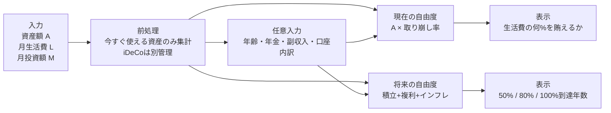

# 日本在住者向けFIREと取り崩し前提の調査報告書

## 要点まとめ

- **4%ルールは「米国の過去データに基づく、30年前後の固定実質取り崩しの経験則」**です。起点はBengenの1994年論文で、Trinity Studyが15〜30年・複数資産配分で成功率を示して広まりました。どちらも**米国資産・米国インフレ・税引前・低コスト前提**であり、そのまま日本在住者へ移植するのは危険です。citeturn14view1turn14view2turn14view3  
- **日本在住者向けの診断サイトでは、4%をデフォルト判定に使わず、2.5%〜3.5%を「保守〜標準レンジ」、4%を「米国史料ベースの参考線」として表示するのが安全**です。国際比較では4%実質取り崩しはかなり脆弱で、Forward-looking研究でも固定実質の安全開始率は4%未満に置かれることが増えています。citeturn14view4turn14view6turn36view1  
- **日本の制度差は大きい**です。新NISAは国内の譲渡益・配当/分配金が非課税ですが、NISA損失は損益通算・繰越控除ができず、**NISA口座内配当にかかる外国税額は外国税額控除の対象外**です。iDeCoは税制面で強い一方、**原則60歳まで引き出せない**ため、早期リタイアのブリッジ資産とは別管理にすべきです。citeturn40view3turn25search3turn25search7turn26view0turn28view0turn41view1  
- **生活費の現実値を入れないと診断が歪みます**。2025年の高齢単身無職世帯の平均消費支出は**月14.8万円**、65歳以上の夫婦のみ無職世帯は**月26.4万円**でした。支出構成では食料が約29%、光熱・水道が約9〜11%、交通・通信が約9〜12%、その他の消費支出が約19〜21%を占めています。citeturn15view0turn16view0turn16view1  
- **海外株インデックス前提では、為替・外国課税・順序効果の3点が根本リスク**です。S&P 500やMSCI ACWIは長期で高いリターンを示してきましたが、直近10年リスクはおおむね15%前後、MSCI ACWIの最大ドローダウンは58.38%でした。円ベース投資家向けに、指数会社自身がJPY換算版・JPYヘッジ版を別建てで提供していること自体、為替が成果を大きく左右することの裏返しです。citeturn19view0turn18view1turn21search0turn21search2turn21search9turn20search0  
- **ジユウノコンパスは「退職できる/できない」の断定ではなく、「今の資産が生活費の何%を支えられるか」「部分FIREならどこまで可能か」「何年で射程に入るか」を示す設計が適切**です。これはTrinity/Bengenが税・制度差を含まないこと、日本の年金・NISA/iDeCo・生活費が個人差大きいこと、動的取り崩しの有効性が大きいことに整合します。citeturn13view0turn28view0turn40view1turn14view5turn36view0turn36view2  

## 4%ルールの由来と統計的前提

4%ルールの原点は、William Bengenが1994年に示した「**初年度4%を引き出し、その後はインフレ調整を行っても、少なくとも30年の資産寿命を維持できる可能性が高い**」という歴史検証です。Bengenは、平均リターンではなく、**1973–74年の高インフレと株安**のような悪い順序の局面を重視しました。citeturn14view1

Trinity Studyはこれを個人投資家向けに広く普及させた研究で、**1926–1995年の米国データ**を用い、**S&P 500を株式、長期高格付社債を債券**として、**15年・20年・25年・30年**の取り崩し期間、**株式比率0〜100%**、**初年度取り崩し率3〜12%**を比較しました。成功の定義は**期間終了時に資産残高が0を超えること**で、**税金・売買コストは調整していません**。citeturn13view0turn14view2

| 研究 | 想定期間 | 主な前提 | 主要な示唆 | 根拠 |
|---|---:|---|---|---|
| Bengen 1994 | 最低30年 | 米国株＋中期国債、インフレ調整後の固定実質取り崩し | 4%初年度＋以後インフレ調整が歴史上の安全域の起点 | citeturn14view1turn14view0 |
| Trinity Study 1998 | 15/20/25/30年 | S&P 500＋長期高格付社債、初年度3〜12%、年次取り崩し、税・コストなし | **30年・インフレ調整4%**は、**100%株=95%**, **75/25=98%**, **50/50=95%**の成功率 | citeturn14view2turn14view3 |
| Cooley et al. 1999 | 15〜30年 | 月次取り崩し・月次リターン、株/債券/現金の混合 | 4%は依然かなり強いが、5%超は期間と配分で悪化しやすい | citeturn11view0 |
| Pfau 2010 | 30年 | 17先進国、1900–2008、各国の株・債券・短期資産を使用 | **4%実質は国際的にはかなり危うい**。50/50配分は17か国すべてでどこかの時点で失敗 | citeturn14view4turn9view2 |
| Guyton-Klinger 2006 | 40年 | モンテカルロ、株式50/65/80%、可変的な意思決定ルール | **固定実質4%**ではなく、**支出調整を許容するなら5.2〜5.6%開始も可能** | citeturn14view5turn9view3 |
| Morningstar 2025 | 30年 | Forward-looking仮定、90%成功、固定実質と複数の柔軟戦略 | **固定実質の開始安全率は3.9%**、柔軟戦略なら**5.7%**まで上振れ余地 | citeturn14view6turn35view0turn36view2 |

ここからサイト実装へ落とすと、**4%ルールは「由来説明用の史料」には使えるが、診断のデフォルト判定には向きません**。理由は単純で、元研究が**米国・30年・税前・固定実質支出**だからです。30代〜40代のFIRE志向者に多い**40〜60年の長期**、日本の**税制・年金・為替**、そして**可変支出**は、元論文の外にあります。citeturn13view0turn14view4turn14view5turn14view6

## 日本在住者が使う場合の補正

### 税制と口座制度

2024年からの新NISAは、**つみたて投資枠120万円/年、成長投資枠240万円/年、非課税保有限度額1,800万円、非課税保有期間は無期限**です。2023年末までの旧つみたてNISA・一般NISA保有分は、**2024年以降も新NISAとは別枠で旧制度の非課税措置が継続**します。また、新NISAでは**売却した簿価分の枠が翌年以降に再利用可能**です。citeturn39view0turn40view3

ただし、NISAは万能ではありません。**NISA口座の損失は一般口座・特定口座と損益通算できず、翌年以降への繰越控除もできません**。さらに、国税庁は**非課税口座内上場株式等の配当等に対して課される外国所得税は外国税額控除の対象外**と明記しています。海外ETFや海外株の配当をNISAで受ける場合、**日本税はゼロでも外国側の課税が残る**ケースがあるため、サイトで「税金ゼロ」と断言するのは危険です。citeturn25search3turn25search7turn26view0

iDeCoは別物です。厚生労働省によると、iDeCoは**掛金全額が所得控除、運用益非課税、受取時も年金なら公的年金等控除、一時金なら退職所得控除**が使えます。一方で、**原則60歳まで資産を引き出せません**。したがって、ジユウノコンパスでは、**iDeCo残高を「将来の老後資産」としては含めても、「今からのFIRE生活費原資」には含めない**のが安全です。citeturn28view0turn41view1

| 制度 | 2026年時点の実務要点 | ジユウノコンパスでの扱い |
|---|---|---|
| 新NISA | 年120万＋240万、総枠1,800万、無期限、売却簿価ぶん再利用可 | **税効率の高い可処分資産**として優先表示 |
| 旧つみたてNISA・一般NISA | 2023年までの保有分は新NISA外枠で旧非課税継続 | 現在資産には含めるが、**新規積立余力とは分離** |
| 課税口座 | 通常約20.315%課税、損益通算・繰越控除・外国税額控除は条件付で活用余地 | **暴落時の税務柔軟性が高い口座**として別表示 |
| iDeCo/企業型DC | 税制優遇大、ただし原則60歳まで引出不可 | **ブリッジ資産と分離**して表示 |

上表のルール整理は、金融庁・国税庁・厚生労働省の制度説明に基づき要約しています。citeturn39view0turn40view3turn25search3turn25search8turn26view0turn28view0

### 年金と生活費

公的年金は、**国民年金が1階、厚生年金が2階**という構造です。厚生労働省は、2026年度時点で**老齢基礎年金の満額は月約7.1万円、支給開始は65歳**と案内しています。また、2026年度末の「厚生年金保険（第1号）の老齢年金」の平均月額は、**基礎年金込みで約15.1万円**でした。もっとも、この平均は働き方・加入月数・報酬に左右されるため、**初期設定に平均値を自動投入するのは避けるべき**です。citeturn40view1turn40view2

生活費側では、2025年の**65歳以上単身無職世帯の消費支出は月148,445円**、**65歳以上夫婦のみ無職世帯は月263,979円**でした。単身・夫婦ともに食費比率が約29%と高く、単身では光熱・水道10.5%、教養娯楽10.9%、その他の消費支出21.3%、夫婦では交通・通信11.9%、その他の消費支出19.4%が目立ちます。これは、サイトの**生活費テンプレート**を作る根拠としてかなり使いやすい数字です。citeturn15view0turn16view0turn16view1

部分FIREの考え方も、日本向けUIでは重要です。FIREコミュニティでは、**Lean FIREはミニマル支出型、Barista FIREは資産収入にパート収入を足す型、Coast FIREは今ある資産を将来のFI到達資金として“寝かせ”、現在の生活費は仕事で賄う型**として使われています。ただし、これらは**法定用語でも学術用語でもなく、実務上の俗称**です。サイトでは「定義はコミュニティで揺れる」と明記しつつ、**日本円ベースの説明**に置き換えるのが安全です。citeturn41view2turn41view3turn29search1

## 計算式と前提

ジユウノコンパスの入力が**資産額・生活費・投資額**に限られるなら、複雑な税最適化や年金最適化を無理にやるより、**現在の自由度**と**将来の到達見込み**を分けて表示する方が正確です。4%ルール原典もTrinityも、**税・制度・個人差を含まない一般化モデル**だからです。citeturn13view0turn14view1turn14view3

### 基本式

**現在の資産が支える年間生活費**

\[
S_0 = A_{\text{acc}} \times w \times (1-c)
\]

- \(A_{\text{acc}}\)：今すぐ取り崩し可能な金融資産
- \(w\)：採用する初期取り崩し率
- \(c\)：税・手数料・外国源泉税・為替バッファ等をまとめた実効ドラグ率

**現在の自由度**

\[
F_0 = \frac{S_0 + Y}{E}
\]

- \(Y\)：安定した年額所得（副業、家賃、すでに受給中の年金など）
- \(E\)：年額生活費

**目標資産額**

\[
A^* = \frac{E - Y}{w(1-c)}
\]

副業や家賃などの**安定収入は必要資産をほぼ線形に減らす**ので、部分FIREの表示に向きます。たとえば、**月5万円の安定収入は年60万円**なので、必要資産は**3.0%基準なら約2,000万円、2.5%基準なら約2,400万円**下がります。これは「Barista FIREが効く理由」を数字で見せやすいポイントです。  

### 将来シミュレーション式

月次投資を入れた将来資産は、月利を \(r_m\) とすると、

\[
A_n = A_0(1+r_m)^n + M \cdot \frac{(1+r_m)^n - 1}{r_m}
\]

- \(A_0\)：現在資産
- \(M\)：月間投資額
- \(n\)：月数

生活費のインフレ反映は、

\[
E_n = E_0(1+\pi_m)^n
\]

とし、将来の自由度は

\[
F_n = \frac{A_n \times w \times (1-c) + Y_n}{E_n}
\]

で出せます。**年齢・年金開始時期が未指定なら \(P=0\) と置く保守表示**にし、年齢が入る上級設定では**年金開始前後の2段階計算**へ切り替えるのが安全です。  

### パラメータ表

| 変数 | 初期推奨 | 意味 | 実装メモ |
|---|---|---|---|
| \(A_{\text{acc}}\) | 必須 | 今すぐ使える資産 | iDeCoは原則除外 |
| \(M\) | 必須 | 毎月の投資額 | iDeCo拠出は別枠扱い推奨 |
| \(E\) | 必須 | 年間生活費 | 単身/夫婦テンプレートを用意 |
| \(Y\) | 任意 | 安定した年間所得 | 部分FIRE判定で重要 |
| \(P\) | 任意 | 年金年額 | 年齢未入力なら未反映 |
| \(w\) | 2.5/3.0/3.5/4.0% | 初期取り崩し率 | 4.0%は参考線扱い |
| \(c\) | 0.5〜1.5% | 実効ドラグ | 税・費用・外国税・為替バッファの近似 |
| \(r_m\) | シナリオ別 | 月次リターン | 将来推計用 |

### 設計用シナリオ

以下は**予測ではなく、診断サイト用の設計レンジ**です。S&P 500とMSCI ACWIのリスク水準、BOJの2%物価目標、2025年CPI上昇率3.2%、そしてMorningstarの3.9% base caseを踏まえ、**最近の高リターンをそのまま期待値にしない**保守設計を推奨します。citeturn19view0turn18view1turn38search0turn38search2turn14view6

| シナリオ | 参考配分 | 名目期待リターン | 年率ボラティリティ | インフレ | 実効ドラグ \(c\) | 表示用取り崩し率 |
|---|---|---:|---:|---:|---:|---:|
| 楽観 | 株80 / 債20 | 6.0% | 14〜16% | 1.5% | 0.5% | 3.5% |
| 中立 | 株60 / 債40 | 4.5% | 10〜12% | 2.0% | 0.8% | 3.0% |
| 悲観 | 株50 / 債50 | 3.0% | 9〜11% | 3.0% | 1.2% | 2.5% |
| 史料参照 | 米国過去データ | — | — | 実績値 | 税前想定 | 4.0% |

この表のポイントは、**取り崩し率 \(w\) と期待リターン \(r\) を分ける**ことです。4%ルールの元研究は「過去の引き出し耐性」の話であり、「今後の期待リターンの予測」ではありません。ここを混同しない表示が大事です。citeturn14view1turn14view3turn14view6

### 暴落時・インフレ時の動的取り崩し

固定実質取り崩しだけを見せると、ユーザーは「毎年同じように使ってよい」と誤解しがちです。そこで、サイトには少なくとも以下の3方式を解説表示すると親切です。citeturn36view0turn36view1turn36view2

| 方式 | 簡易式 | 長所 | 弱点 |
|---|---|---|---|
| 固定実質 | \(W_t = W_{t-1}(1+\pi_t)\) | わかりやすい | 順序効果に弱い |
| インフレ見送り | 前年下落なら \(W_t = W_{t-1}\) | 生活水準の急落を抑えつつ防御 | 実質支出はじわじわ減る |
| Guardrails | 予定引出率が初期率の±20%を超えたら、支出を±10%調整 | 初期引出率を上げやすい | 支出が年ごとに変動 |
| Floor/Ceiling | 前年比の増減幅に上限・下限を設ける | 変動を丸くできる | 厳密には設計がやや複雑 |

Morningstar 2025では、Guardrailsなどの柔軟戦略は**固定実質より高い開始率を許す一方、支出変動を受け入れる必要がある**と整理されています。Schwabのバケツ戦略は、現金・債券・株式を時間帯別に分け、**順序効果と心理的な不安を減らす運用補助策**として位置づけるのが無難です。citeturn36view0turn36view2turn34search1turn33search3

## 注意点

- **4%＝安全**ではありません。原典は米国の過去データで、30年・税前・固定実質支出という条件付きです。日本在住者、40年以上の引退、為替込みにはそのまま使えません。citeturn14view1turn14view3turn14view4turn14view6  
- **iDeCoは「資産」でも、早期リタイアの生活費原資ではない**場合が多いです。原則60歳まで引き出せないからです。citeturn28view0turn41view1  
- **新NISAは有利ですが、損失通算や繰越控除はできません。** また、NISA内配当にかかる外国税額は外国税額控除の対象外です。citeturn25search3turn25search7turn26view0  
- **S&P 500やACWIの“過去10年成績”を、そのまま将来期待にしない**ことが重要です。S&P 500の直近10年年率リターンは高い一方、リスクも約15%で、2022年にはトータルリターンがマイナス18.11%でした。MSCI ACWIの最大ドローダウンは58.38%でした。citeturn19view0turn18view1  
- **円建て生活者には為替が別のリスクレイヤー**です。S&PやMSCIがJPY換算版・JPYヘッジ版を別々に提供している以上、円高・円安で体感リターンは大きく変わります。citeturn21search0turn21search2turn21search9turn20search0  
- **配当だけで暮らす設計は危うい**です。2026年4月末時点のS&P 500の配当利回りは1.13%、MSCI ACWIは1.62%であり、生活費を賄うには通常、配当だけでなく売却を伴う総合リターンの考え方が必要です。citeturn19view0turn18view1  
- **年金の平均額を自動で当て込まない**方が安全です。基礎年金満額や厚生年金平均は参考にはなるものの、加入歴・報酬・就業形態で差が大きいからです。citeturn40view1turn40view2  

## ジユウノコンパスに反映できる表示案

サイトの主役は「FIRE可否」ではなく、**生活費に対する資産カバー率**です。元研究がそうであるように、取り崩しは確率・期間・配分・税でブレます。したがって、最も誤解が少ないUIは、**現在の自由度 / 部分FIRE適性 / 将来到達見込み**の3本立てです。citeturn13view0turn14view5turn14view6

### 推奨カード構成

| カード | 表示内容 | 表示ルール |
|---|---|---|
| いまの自由度 | 「資産が支える月額」 | 2.5% / 3.0% / 3.5%の3レンジ表示 |
| 部分FIRE適性 | 「あと月いくらの安定収入で届くか」 | 不足額 = 生活費 − 資産支え月額 |
| 到達見込み | 「今の積立なら何年で50%/80%/100%に届くか」 | 楽観 / 中立 / 悲観で分岐 |
| 参考線 | 「米国過去データの4%参考線」 | グレー表示。主判定に使わない |

### 色分け基準

| 色 | 基準 | 推奨ラベル |
|---|---|---|
| 緑 | **2.5%基準**で生活費カバー率100%以上 | かなり自由度が高い |
| 黄緑 | 3.0%基準で100%以上、ただし2.5%では未満 | かなり近い |
| 黄 | 3.0%基準で50〜99% | 部分FIREが現実的 |
| 橙 | 3.0%基準で25〜49% | 選択肢は増えるが生活費は未達 |
| 赤 | 3.0%基準で25%未満 | まだ資産形成フェーズ |

### 資産額別の現実的メッセージ例

下表は**年金ゼロ・副収入ゼロ・3.0%基準**の単純比較です。月額支え額は \(\text{資産額} \times 3\% \div 12\) の助手計算です。

| 資産額 | 資産が支える月額 | 15万円生活 | 20万円生活 | 30万円生活 | 現実的メッセージ |
|---:|---:|---:|---:|---:|---|
| 500万円 | 1.25万円 | 8% | 6% | 4% | **完全FIRE判定はまだ早い**。緊急資金・転職バッファ・副業育成資金としては有効。 |
| 1,000万円 | 2.5万円 | 17% | 12% | 8% | **生活費の一部を資産で肩代わりできる段階**。時短勤務や学び直しの自由度は上がる。 |
| 3,000万円 | 7.5万円 | 50% | 38% | 25% | **Barista/部分FIRE帯**。月7〜13万円ほどの安定収入があれば現実味が出る。 |
| 5,000万円 | 12.5万円 | 83% | 62% | 42% | **Lean FIREにかなり近い帯**。単身15万円生活なら、年金開始後を含めて十分射程圏。 |
| 1億円 | 25万円 | 167% | 125% | 83% | **単身20万円生活なら強い**。ただし30〜50年の超長期なら、可変支出と暴落対応を前提に。 |

この表の読み方として、**月5万円の安定収入は3.0%基準で必要資産約2,000万円分**、**月10万円なら約4,000万円分**に相当します。だからこそ、部分FIREは「中くらいの資産＋小さめの安定収入」でいきなり現実的になります。  

### 部分FIREの定義と架空例

以下は**説明用の架空例**です。定義自体はコミュニティ用語なので、サイトでは「目安」と書くのが安全です。citeturn41view2turn41view3turn29search1

| タイプ | サイト上の実務定義 | 架空例 |
|---|---|---|
| Partial FIRE | 生活費の一部を資産収入で賄える | 1,000万円・月20万円生活・3%基準なら月2.5万円を資産が補助 |
| Barista FIRE | 資産収入＋パート/業務委託で生活費を満たす | 3,000万円で月7.5万円＋副収入8万円＝月15.5万円 |
| Lean FIRE | 固定費の小さい生活を、資産のみでかなり賄える | 5,000万円で月12.5万円。単身15万円生活なら年金前でもかなり近い |
| Coast FIRE | 追加拠出がなくても将来FI到達見込みがある | 35歳・65歳時に6,000万円必要、実質3%なら現在約2,470万円が目安 |

## ユーザー向け文言案と免責表現

### 短文と説明文

**短文ラベル案**

- いまの資産で、生活費の**62%**を支えられる目安です  
- あと**月8万円**の安定収入があれば、部分FIREが見えてきます  
- 今の積立ペースなら、**中立シナリオで9年後**に生活費の100%圏内です  
- 4%ルールは**米国の過去データの参考線**として表示しています  

**説明文案**

- この診断は、米国の4%ルールをそのまま適用せず、**日本の税制・NISA/iDeCo・為替・インフレ**を踏まえた保守〜標準レンジで表示しています。citeturn14view4turn14view6turn39view0turn28view0  
- 表示される「資産が支える月額」は、**今すぐ使える資産だけ**を前提にした目安です。iDeCoなど原則60歳まで使えない資産は別扱いにするのが安全です。citeturn28view0turn41view1  
- 海外株インデックスの成績は、**円ベースでは為替の影響**を受けます。好調な年でも、円高で体感リターンが鈍ることがあります。citeturn21search0turn21search2turn20search0  

### 誤解を避ける表現

| 避けたい表現 | 推奨表現 |
|---|---|
| あなたはFIRE達成です | この条件では、**生活費の何%を資産が支えられるかの目安**を表示しています |
| 4%なら安全です | 4%は**米国の過去データに基づく30年の参考線**で、日本在住者には下振れ余地があります |
| NISAなら税金ゼロです | **日本国内の非課税メリットは大きい**一方、外国課税が残る場合があります |
| iDeCoも入れればもう自由です | iDeCoは**老後資産として有力**ですが、原則60歳まで引き出せません |
| S&P500なら長期で勝てます | S&P500は長期実績がありますが、**将来収益・為替・暴落順序は不確実**です |

### 免責表現の例

**短い免責**

> 本診断は一般的な情報提供を目的とした参考表示であり、将来の運用成果、資産寿命、税額、受給額を保証するものではありません。

**標準免責**

> 本診断は、公開情報に基づく一般的な前提と入力値から算出した参考値です。実際の資産寿命や取り崩し可能額は、将来の市場環境、税制、為替、物価、年金受給額、家族構成、健康状態、住宅費などにより大きく異なります。投資判断、税務判断、退職判断は、必要に応じて専門家へご相談ください。

**詳しめの免責**

> 本サービスの表示は、米国の歴史研究・日本の公的統計・現行制度をもとにした一般的な試算であり、個別の投資助言、税務助言、退職助言ではありません。NISA/iDeCo等の制度内容や税制は将来変更される可能性があります。また、外国資産には為替変動、外国課税、制度変更等の追加リスクがあります。表示結果は将来の運用成果や資産が尽きないことを保証するものではありません。citeturn39view0turn40view3turn28view0turn26view0  

### 未指定事項と限界

今回の依頼条件だけでは、**年齢、家族構成、住居費（持家/賃貸/ローン残高）、現金クッション、口座内訳（NISA/課税/iDeCo）、年金見込額、社会保険料、医療・介護想定、副収入の安定性**が未指定です。したがって、ジユウノコンパスの初期版は**「自由度の目安」表示に徹し、「退職可否の断定」は避ける**のが最も安全です。